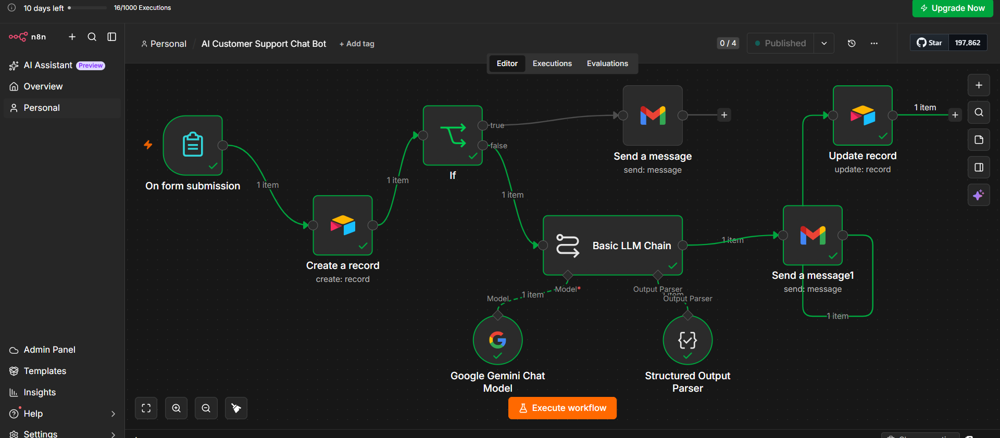

# AI Customer Support Automation

## 📌 Project Overview

An AI-powered customer support workflow designed to automate the handling of customer enquiries and reduce repetitive support tasks.

The workflow captures customer enquiries, stores them in Airtable, uses AI to generate a professional response, sends the response by email, and updates the enquiry record after the response is sent.

## 🔄 Workflow

Customer submits support enquiry
↓
Customer information and question captured
↓
Enquiry saved to Airtable
↓
AI analyzes the customer's question
↓
AI generates a professional response
↓
Response emailed to the customer
↓
Airtable record updated with:
- Date
- AI Response
- Status: Answered

## 🚨 Human Escalation

Certain sensitive enquiries can bypass the AI response and be escalated to a human.

Examples include:

- Refund requests
- Cancellation requests
- Complaints
- Angry or dissatisfied customers

When a sensitive enquiry is detected, the workflow can notify a human through Slack or Gmail instead of automatically responding.

## 🛠️ Tools Used

- n8n
- Airtable
- Google Gemini AI
- Gmail
- Slack

## 🤖 AI Response Generation

The AI generates professional and friendly responses based on the customer's enquiry.

The workflow is designed to reduce repetitive customer-support work while maintaining a clear record of each enquiry and its response.

## 🎯 Business Value

This automation can help businesses:

- Reduce repetitive support tasks
- Respond to customers faster
- Keep support enquiries organized
- Maintain consistent responses
- Escalate sensitive issues to human staff
- Track the status of customer enquiries

## 🔐 Privacy & Security

This repository contains a portfolio demonstration of the workflow.

No real customer information, passwords, API keys, authentication credentials, or private business data are included.

## 👨‍💻 Built By

**Maxwell Osita Odo**

AI Automation & Workflow Specialist

Specializing in:

- AI Workflow Automation
- n8n
- Make
- Zapier
- Airtable
- AI Integrations
- Business Process Automation

## 📁 Project Structure

ai-customer-support-automation/
├── README.md
└── ai-customer-support-workflow.png
